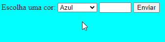
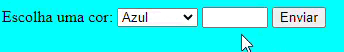
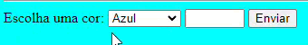

# Projeto - Calendário

# Descrição

Calendário interativo onde o usuário poderá marcar algum dia do mês.

Ele poderá selecionar cores pré definidas para marcar o dia, e também selecionar o dia.

Após selecionar a cor e o dia, ele pressionará o botão "Enviar", marcando assim o dia.

# Introdução e Funcionalidades

Lista de cores para o usuário selecionar de acordo com oque quiser marcar.

Espaço onde o usuário, após escolher a cor, poderá selecionar o dia no qual deseja marcar.

Após o usuário selecionar a cor e o dia, ele terá que pessionar o botão "Enviar" para fazer a marcação.

## Tecnologias Utilizadas

Foi usado para esse calendário interativo o aplicativo [**Visual Studio Code**](https://code.visualstudio.com/) para criar o **HTML5**, **JavaScript** e **CSS3** (CSS3 foi usado para o estilo da página)

# Fontes Consultadas

Para a aparência dos botões foi usado o **Bootstrap**, e o HTML e o JavaScript foi feito com ajuda do professor.
* [Bootstrap](https://getbootstrap.com/) - Usado para o design dos botões.